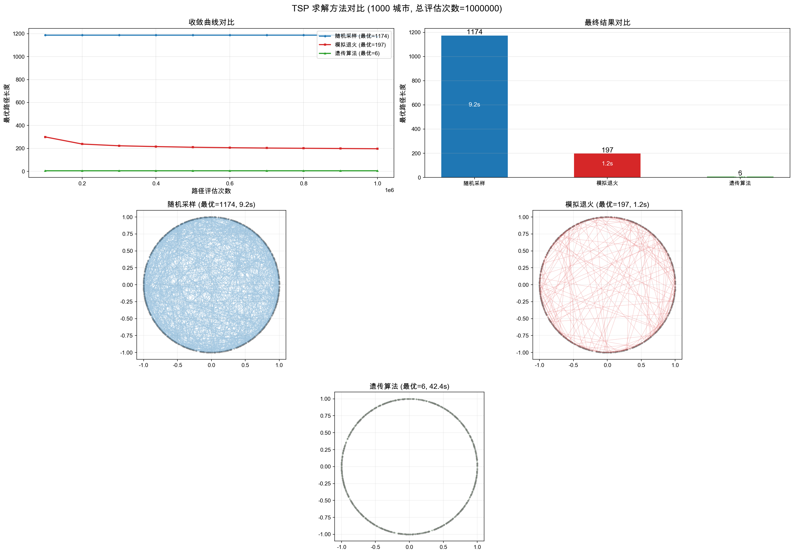

# TSP - 旅行商问题求解

## 项目概述

使用多种算法求解 TSP（Travelling Salesman Problem），对比不同方法的求解质量与性能。

- 城市数量：1000
- 坐标数据：`data/TSP1.txt`（每行一个城市，格式 `x,y`，坐标范围 [-1, 1]）

## 目录结构

```
TSP/
├── README.md
├── setup.py                    # Cython 编译脚本
├── requirements.txt            # Python 依赖
├── .clangd                     # clangd 配置（IDE 提示用）
├── .gitignore
├── data/
│   └── TSP1.txt                # 城市坐标数据（1000 个城市）
├── include/
│   └── tsp_utils.h             # C++ 头文件（TSPUtils 类）
├── src/
│   ├── tsp_utils.cpp           # C++ 核心实现
│   ├── tsp_core.pxd            # Cython C++ 声明
│   └── tsp_core.pyx            # Cython Python 包装
├── scripts/
│   ├── random_search.py        # 方法1：随机采样
│   ├── simulated_annealing.py  # 方法2：模拟退火
│   ├── genetic_algorithm.py    # 方法3：遗传算法
│   └── compare.py              # 对比脚本（生成对比图）
└── output/                     # 运行产物（图片等）
```

## 架构设计

采用 **C++ 核心 + Cython 桥接 + Python 算法** 的三层架构：

- **C++ 层**（`src/tsp_utils.cpp`）：高性能计算（数据加载、距离矩阵、路径评估）
- **Cython 层**（`src/tsp_core.pxd` + `tsp_core.pyx`）：桥接 C++ 与 Python，提供 Pythonic 接口；算法循环也在 Cython 层完成，避免逐次跨语言调用
- **Python 层**（`scripts/`）：算法控制、结果输出、可视化

### 优势

1. **性能**：密集计算在 C++ 中完成，Cython 零开销桥接
2. **灵活**：Python 层方便实现新算法、数据分析
3. **简洁**：`python setup.py build_ext --inplace` 一步编译，无需 CMake

## 环境搭建

```bash
python3 -m venv .venv
source .venv/bin/activate
pip install -r requirements.txt
python setup.py build_ext --inplace
```

## 算法详解

### 方法1: 随机采样 (Random Search)

**思想**：在解空间中均匀随机采样，选取最优解。最朴素、最暴力的方法。

**步骤**：
1. 生成城市排列 `[0, 1, 2, ..., n-1]` 作为初始路径
2. 每次迭代用 Fisher-Yates shuffle 随机打乱路径
3. 计算新路径长度，若更优则保留
4. 重复 N 次，输出历史最优

**特点**：
- 策略：纯随机探索，没有任何方向引导
- 优点：实现简单，不会陷入局部最优（因为完全不依赖历史信息）
- 缺点：1000 个城市的解空间是 1000! ≈ 10^2567，随机命中好解的概率几乎为 0
- 收敛快但饱和早：几万次就能找到可靠的上界，之后几乎不再改善

### 方法2: 模拟退火 (Simulated Annealing)

**思想**：模拟金属退火过程——高温时原子剧烈运动（允许大范围探索），逐步降温后趋于稳定（精细搜索）。通过概率接受较差解来跳出局部最优。

**步骤**：
1. 随机初始化一条路径，设定初始温度 `T_start`
2. 每次迭代：随机交换两个城市，计算路径长度变化 `Δ = new - current`
3. 接受准则（Metropolis）：
   - 若 `Δ < 0`（更优解）：**总是接受**
   - 若 `Δ > 0`（较差解）：**以概率 P = e^(-Δ/T) 接受**
4. 温度按指数衰减：`T = T × α`
5. 温度降到 `T_end` 后不再降温，全接受更优解

**核心——Metropolis 准则**：
- 高温时（T 大）：`e^(-Δ/T)` 接近 1 → 容易接受差解 → **全局探索**
- 低温时（T 小）：`e^(-Δ/T)` 接近 0 → 只接受好解 → **局部优化**
- 这保证了算法能从局部最优"跳出"，又有机会收敛到全局最优

**参数作用**：

| 参数 | 默认值 | 作用 |
|------|--------|------|
| `T_start` | 100.0 | 初始温度，越大探索性越强 |
| `T_end` | 0.001 | 结束温度，越小优化越精细 |
| `alpha` | 0.9999 | 降温速率，越接近 1 降温越慢、搜索越充分 |

### 方法3: 遗传算法 (Genetic Algorithm)

**思想**：模拟生物进化过程，通过选择、交叉、变异三个遗传算子迭代优化种群。维护多个解的种群，利用交叉操作组合优秀基因片段。

**步骤**：
1. 随机初始化种群（pop_size 条路径）
2. 计算每条路径的适应度（路径长度的倒数）
3. **选择**：锦标赛选择（tournament selection），从种群中随机选 k 个个体，取最优者作为父代
4. **交叉**：顺序交叉（Order Crossover, OX），从父代1复制一段路径片段，剩余位置按父代2顺序填充
5. **变异**：交换变异（swap mutation），以一定概率随机交换两个城市的位置
6. **精英保留**：每代保留适应度最高的 elite_size 个个体直接进入下一代
7. 重复 N 代，输出历史最优

**核心——三大遗传算子**：
- **选择**：引导搜索方向，让优秀个体有更多机会繁殖
- **交叉**：组合不同优秀解的基因片段，可能产生更优后代
- **变异**：维持种群多样性，防止早熟收敛到局部最优

**参数作用**：

| 参数 | 默认值 | 作用 |
|------|--------|------|
| `pop_size` | 100 | 种群大小，越大搜索越充分但越慢 |
| `generations` | 10000 | 总代数 |
| `mutation_rate` | 0.05 | 变异概率，太小易早熟，太大破坏优秀解 |
| `elite_size` | 10 | 精英保留数量，保证最优解不丢失 |

## 算法对比



### 性能对比（1000 城市，100 万次评估）

| 方法 | 最优路径长度 | 耗时 | 策略 |
|------|-------------|------|------|
| 随机采样 | ~1176 | ~11.5s | 均匀随机采样 |
| 模拟退火 | ~195 | ~1.4s | 随机邻域 + Metropolis 准则 |
| 遗传算法 | ~195 | ~10.0s | 选择 + 交叉 + 变异 |

**结论**：
- 模拟退火和遗传算法在相同评估次数下效果相当（~195），但模拟退火快 7 倍
- 遗传算法的交叉操作能组合优秀基因片段，但 Python 层开销较大
- 随机采样在 100 万次评估后几乎无改善（~1176），说明纯随机搜索效率极低
- 模拟退火的"变异"（随机交换）与遗传算法的"变异"本质相同，但模拟退火通过温度控制探索-利用平衡更高效

## 运行方式

所有脚本均自动加载 `.venv`，无需手动 `source activate`。

### 随机采样
```bash
python scripts/random_search.py 1000000 100000
```

### 模拟退火
```bash
python scripts/simulated_annealing.py 100000 10000 100.0 0.001 0.9999
```

### 遗传算法
```bash
python scripts/genetic_algorithm.py 10000 1000 100 0.05 10
```

### 对比脚本
```bash
python scripts/compare.py
```
