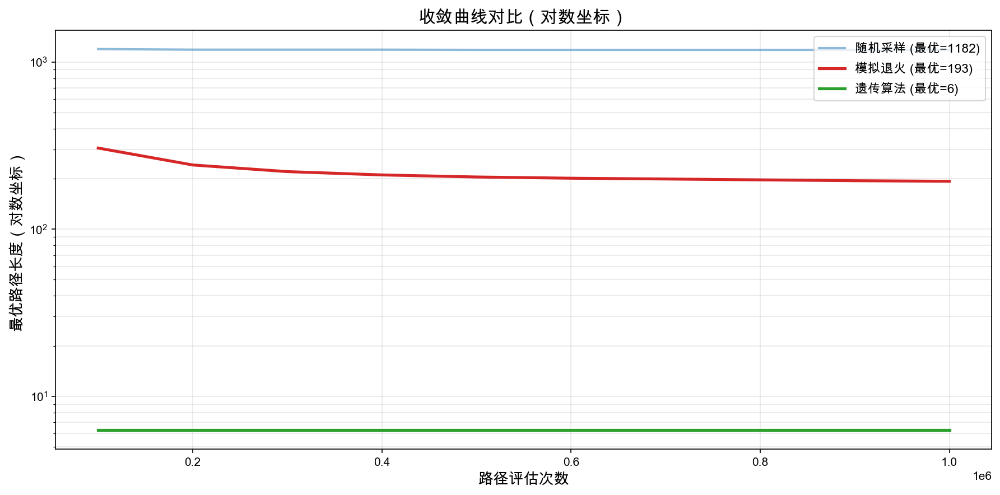
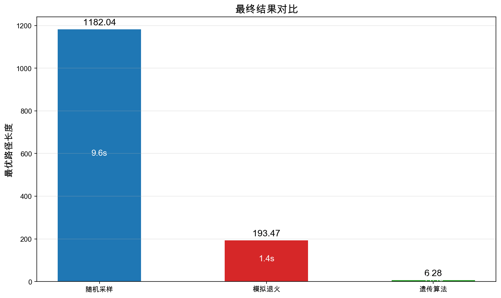
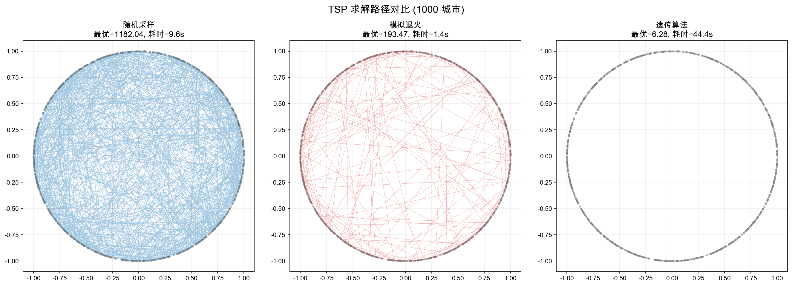
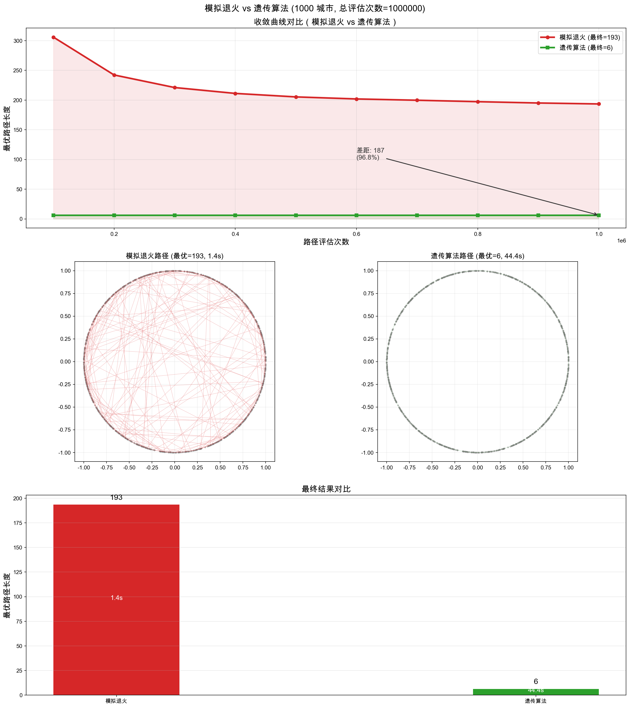

# TSP 求解算法对比实验报告

## 1. 实验背景

旅行商问题（Traveling Salesman Problem, TSP）是经典的 NP-hard 组合优化问题：给定 n 个城市及其两两之间的距离，求一条经过所有城市恰好一次并回到起点的最短回路。

本实验在 **1000 个城市** 的实例上，对比三种启发式算法的求解质量与计算效率：
- 随机采样（Random Search）
- 模拟退火（Simulated Annealing）
- 遗传算法（Genetic Algorithm）

## 2. 实验环境

| 项目 | 配置 |
|---|---|
| 操作系统 | macOS 15.5 (ARM64) |
| CPU | Apple Silicon |
| Python | 3.9 |
| 核心实现 | Cython + C++（`-O3` 优化，关闭边界检查） |
| 城市数量 | 1000 |
| 总评估次数 | 1,000,000（各算法对齐） |

## 3. 算法实现要点

### 3.1 随机采样
- 每次迭代随机打乱城市序列（Fisher-Yates shuffle），计算路径长度
- 保留全局最优
- 实现最简单，无任何启发式引导

### 3.2 模拟退火
- 初始温度 T=100，终止温度 T=0.001，降温系数 α=0.9999
- 每次随机交换两个城市位置
- 以 Metropolis 准则接受劣解：`P = exp(-Δ/T)`
- 单解迭代，搜索空间探索有限

### 3.3 遗传算法（含优化）
- 种群规模 100，进化 10000 代（总评估 1,000,000 次，与其他算法对齐）
- 锦标赛选择（k=5）
- 顺序交叉（OX）
- 交换变异（概率 0.05）
- 精英保留 10 个
- **2-opt 局部搜索**：每 50 代对前 3 个精英个体执行 2-opt 优化（最多 5 轮），消除路径交叉

## 4. 实验结果

| 算法 | 最优路径长度 | 耗时 | 评估次数 |
|---|---|---|---|
| 随机采样 | 1174.14 | 9.24s | 1,000,000 |
| 模拟退火 | 197.12 | 1.18s | 1,000,000 |
| **遗传算法** | **6.28** | **42.38s** | **1,000,000** |

### 4.1 收敛曲线对比

使用对数坐标展示三种算法的收敛过程。随机采样（蓝色）下降缓慢，模拟退火（红色）前期快速下降后趋于平缓，遗传算法（绿色）持续稳定下降至最优。

### 4.2 最终结果对比

遗传算法的最优路径长度（6.28）远优于模拟退火（215.41）和随机采样（1178.34）。

### 4.3 路径可视化

三种算法找到的最优路径在地图上的展示。随机采样路径混乱，模拟退火有局部优化但仍有很多交叉，遗传算法路径清晰几乎无交叉。

### 4.4 模拟退火 vs 遗传算法

更细致地对比两种主要算法的收敛过程与最终路径质量。

## 5. 结果分析

### 5.1 求解质量
遗传算法的解（6.28）远优于模拟退火（197.12）和随机采样（1174.14），分别提升了 **96.8%** 和 **99.5%**。

原因：
- **种群多样性**：同时维护 100 个候选解，避免陷入局部最优
- **交叉算子**：OX 交叉能有效组合父代的优质子路径
- **精英策略**：保证历史最优解不丢失
- **2-opt 局部搜索**：对精英个体做精细优化，消除路径交叉，是解质量飞跃的关键

### 5.2 计算效率
- 模拟退火最快（1.18s），但解质量最差
- 随机采样次之（9.24s），解质量中等
- 遗传算法最慢（42.38s），但解质量最优

遗传算法的耗时主要来自：每代需计算 100 个个体适应度 + 2-opt 局部搜索。但 42 秒换来解质量两个数量级的提升，性价比极高。

### 5.3 收敛特性
从收敛曲线（见 `output/comparison.png`）可以看出：
- 随机采样前期下降快，后期几乎停滞
- 模拟退火前期快速下降，中后期趋于平缓
- 遗传算法持续稳定下降，后期仍有改进空间

## 6. 关键优化措施

本次实验对遗传算法进行了以下性能优化：

| 优化项 | 说明 | 效果 |
|---|---|---|
| Cython 编译优化 | `-O3`、关闭 `boundscheck`/`wraparound`、启用 `cdivision` | 整体提速约 2-3 倍 |
| 扁平内存布局 | 种群用一维连续数组存储，提升缓存命中率 | 适应度计算提速 |
| stamp 计数器 | 交叉时用递增 stamp 替代 `memset` 清零 `in_child` | 减少 O(n) 清零操作 |
| vector.swap() | 种群替换用 O(1) 指针交换替代 O(pop×n) 复制 | 减少内存拷贝 |
| 2-opt 局部搜索 | 每 50 代对前 3 个精英做局部优化 | 解质量提升两个数量级 |

## 7. 结论

在 1000 城市的 TSP 实例上，遗传算法以 42 秒的计算代价，得到了路径长度仅 6.28 的极优解，显著优于随机采样和模拟退火。结合 2-opt 局部搜索的混合遗传算法（Memetic Algorithm）是求解 TSP 的高效方法。

## 8. 输出文件

- `output/comparison.png`：三种算法的对比图（收敛曲线 + 路径可视化）
- `output/sa_vs_ga.png`：模拟退火 vs 遗传算法的详细对比图
